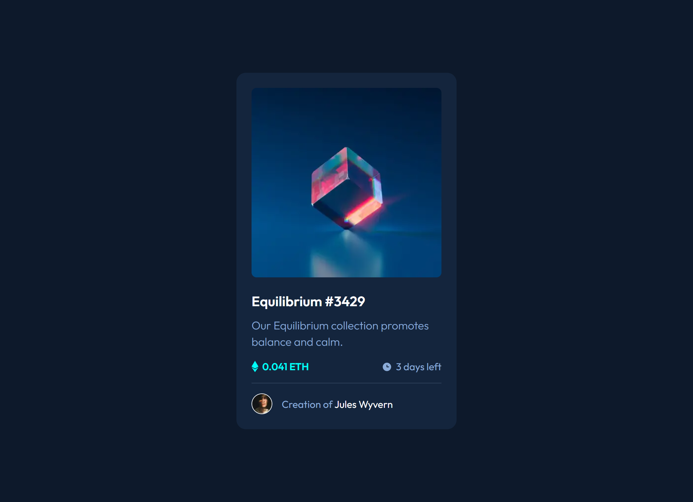

# Frontend Mentor - NFT preview card component solution

This is a solution to the [NFT preview card component challenge on Frontend Mentor](https://www.frontendmentor.io/challenges/nft-preview-card-component-SbdUL_w0U). Frontend Mentor challenges help you improve your coding skills by building realistic projects.

## Table of contents

- [Overview](#overview)
  - [The challenge](#the-challenge)
  - [Screenshot](#screenshot)
  - [Links](#links)
- [My process](#my-process)
  - [Built with](#built-with)
  - [What I learned](#what-i-learned)
- [Author](#author)

## Overview

### The challenge

Users should be able to:

- View the optimal layout depending on their device's screen size.
- See hover states for interactive elements.
- Use keyboard to focus on the image and the empty links.
- Press Enter or Click on the NFT preview image to view full quality version in a modal.

### Screenshot



### Links

- Solution URL: [Add solution URL here](https://github.com/Arsalan2078/nft-preview-card-component.git)
- Live Site URL: [Add live site URL here](https://nft-preview-card-component-beige-eight.vercel.app/)

## My process

### Built with

- Semantic HTML5 markup
- CSS custom properties
- Flexbox
- Mobile-first workflow
- Tailwind
- [Next.js](https://nextjs.org/) - React framework

### What I learned

Getting familiar with Tailwind CSS 4.0. Learned useful classes, such as "group" that allow trigger children focus styles when parent is hovered/focused.

```html
<div className="group">
  <div className="opacity group-hover:opacity-100 group-focus:opacity-100">
    stuff
  </div>
</div>
```

## Author

- Frontend Mentor - [@Arsalan2078](https://www.frontendmentor.io/profile/Arsalan2078)
